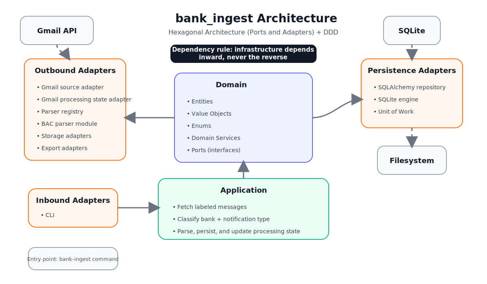

# bank_ingest


Automated ingestion pipeline for extracting **structured financial events** from bank email notifications.

`bank_ingest` processes transaction emails received in Gmail, parses their content, and converts them into normalized financial events stored in a local database.

The project is designed both as a **practical automation tool** and as a **learning exercise in industrial-grade software architecture**.

---

## Features

- Automated ingestion of **bank notification emails**
- Extraction of **structured financial data**
- Persistent storage of financial events
- Clear **processing state tracking** in Gmail via labels
- Modular **parser architecture per bank**
- Built using **Hexagonal Architecture + Domain-Driven Design**

---

## Architecture Diagram

<p align="center">
  
</p>

---

## Example Pipeline

```text
Gmail (label: Transactions)
        │
        ▼
Message ingestion
        │
        ▼
Bank + notification classification
        │
        ▼
Parser selection
        │
        ▼
Structured event extraction
        │
        ▼
SQLite persistence
        │
        ▼
Update Gmail label
(parsed / error)
```

---

## Example Extracted Event

```json
{
  "bank": "BAC",
  "event_type": "card_transaction",
  "merchant": "AMPM",
  "transaction_date": "2026-03-15",
  "card_brand": "VISA",
  "card_last4": "1234",
  "authorization_code": "A82F3D",
  "transaction_type": "purchase",
  "amount": 12000,
  "currency": "CRC"
}
```

---

## Architecture

The system follows **Hexagonal Architecture (Ports and Adapters)** combined with **Domain-Driven Design**.

```text
adapters → application → domain
```

| Layer           | Responsibility                                                |
| --------------- | ------------------------------------------------------------- |
| **domain**      | Core problem model (entities, value objects, ports)           |
| **application** | Use cases orchestrating the ingestion pipeline                |
| **adapters**    | Integration with external systems (Gmail, SQLite, filesystem) |
| **shared**      | Common utilities                                              |

**Key rule**

> The domain layer never depends on infrastructure.

---

## Parser Design

Bank notifications vary widely in structure, so parsers are **modular and extensible**.

```text
parser/
├── base.py
├── registry.py
└── bac/
    ├── classifier.py
    ├── patterns.py
    └── transaction_notification.py
```

Each parser handles:

- a specific **bank**
- a specific **notification type**

This design allows adding new banks without modifying existing parsers.

---

## Initial Scope

The first version supports:

| Feature        | Supported                                                                     |
| -------------- | ----------------------------------------------------------------------------- |
| Bank           | BAC Credomatic                                                                |
| Notification   | Card transaction                                                              |
| Data extracted | merchant, date, card brand, last digits, authorization code, amount, currency |

The architecture is designed to scale to **multiple banks and notification types**.

---

## Requirements

- Python **3.12+**
- Gmail API credentials (`credentials.json`)
- Gmail OAuth authorization

---

## Installation

```bash
uv sync
```

---

## Usage

```bash
bank-ingest --help
```

Typical workflow:

```bash
bank-ingest process-inbox
```

---

## Running Tests

```bash
pytest
```

Tests include:

- unit tests
- adapter tests
- integration tests

---

## Project Structure

```text
bank_ingest/
│
├── ADR/              # Architectural Decision Records
├── src/
│   └── bank_ingest
│       ├── domain
│       ├── application
│       ├── adapters
│       └── shared
│
├── data/             # runtime artifacts (not versioned)
├── logs/
└── tests/
```

---

## Architectural Decisions

Design decisions are documented using **ADR (Architecture Decision Records)**.

| ADR  | Topic                            |
| ---- | -------------------------------- |
| 0000 | Project structure                |
| 0001 | Hexagonal architecture           |
| 0002 | Gmail as ingestion source        |
| 0003 | Local artifact storage policy    |
| 0004 | Parser strategy                  |
| 0005 | Bootstrap & dependency injection |
| 0006 | Parser registry                  |
| 0007 | Processing state port            |

---

## Security

- Gmail access via **OAuth2**
- No passwords stored
- Credentials stored outside the repository

---

## Why This Project Exists

The project serves two purposes:

1. **Automate financial event extraction** from bank emails.
2. Practice **software architecture patterns used in production systems**, including:

- Hexagonal Architecture
- Domain-Driven Design
- Dependency Injection
- Clean separation of infrastructure and domain logic

---

## Future Improvements

- Support for additional banks
- More notification types
- Event export to external systems
- Dashboard for financial analysis
- Scheduled processing

---

## References

- Alistair Cockburn — Hexagonal Architecture
- Eric Evans — Domain-Driven Design
- Martin Fowler — Patterns of Enterprise Application Architecture
- Robert C. Martin — Clean Architecture
